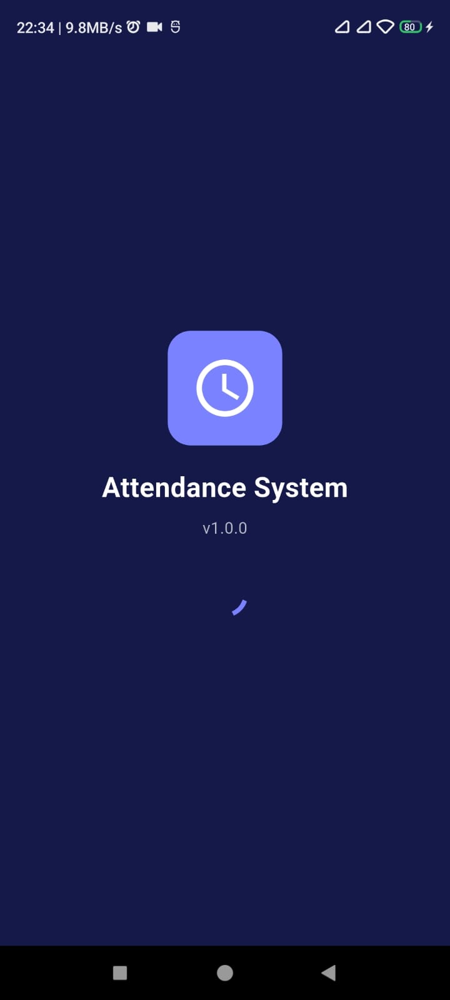
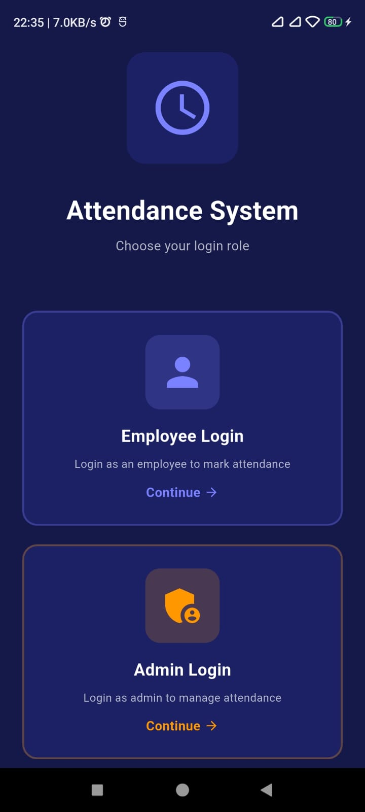
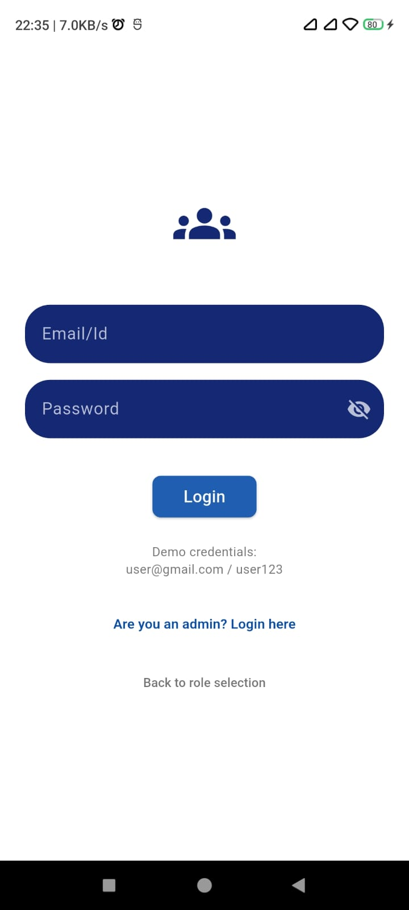
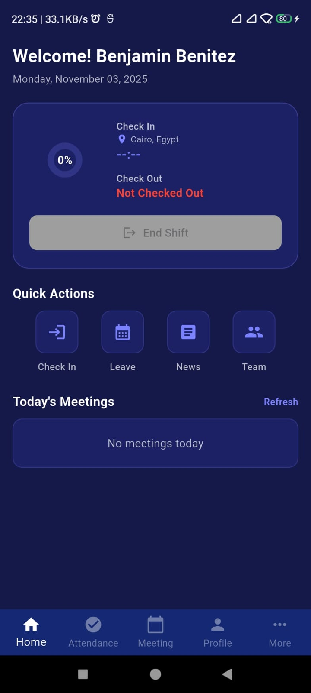
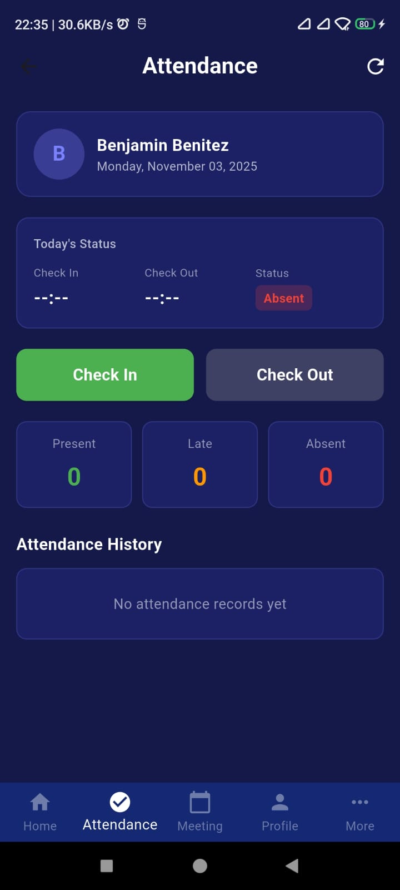
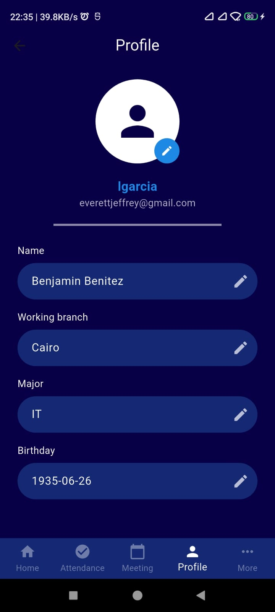
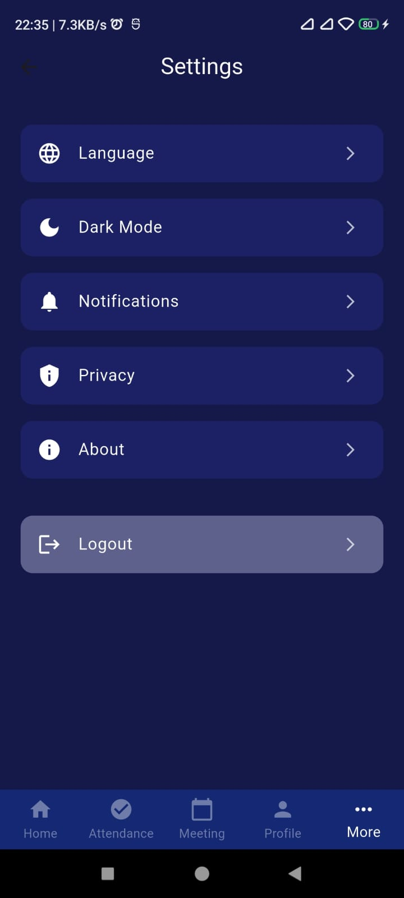
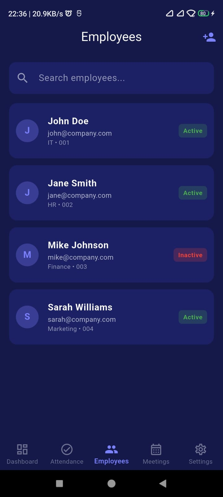
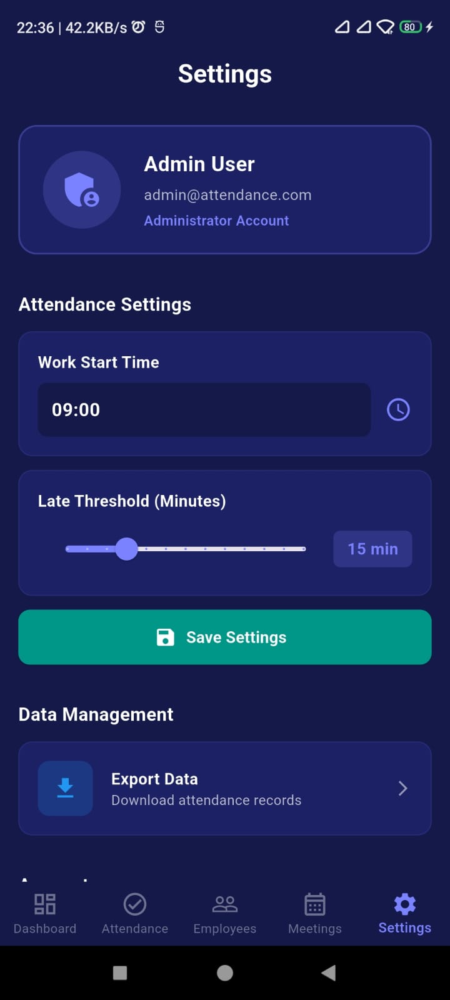

# 📱 Attendance System

A Flutter-based mobile application for managing employee attendance and meetings with dual-role authentication (Admin & User) and complete offline support using SharedPreferences.

---
## 🎯 Overview

The Attendance System is a mobile app that enables employees to check in/out and view meetings, while admins can create and manage meetings. All data is stored locally, allowing the app to work completely offline.

**What's Included:**
- User & Admin Login
- Meeting Management (Create/Edit/Delete)
- Attendance Tracking (Check-in/Check-out)
- Meeting Calendar View
- User Dashboard
- Admin Dashboard
- Offline Support (SharedPreferences)
- Meeting Persistence After Logout

---
### Figma Design Reference
[View Design on Figma](https://www.figma.com/design/fi74eVFunD5W6aqUe3Yx5W/Attendance_System)

---
## ✨ Features

### User Features
- Login with email & password
- View dashboard with attendance info
- Check-in & Check-out
- View meetings calendar
- View profile & settings

### Admin Features
- Separate admin login
- Create new meetings
- Edit existing meetings
- Delete meetings
- View all meetings with filter
- Manage attendance records

### Data Management
- All data saved locally (no backend needed)
- Meetings persist after logout
- Attendance records stored with timestamps

---

## 📁 Project Structure

```
lib/
├── main.dart                    # App entry point
├── pages/
│   ├── splash_screen.dart
│   ├── login_page.dart
│   ├── role_selection.dart
│   ├── userdashboard_page.dart
│   ├── attendance_page.dart
│   ├── meeting_page.dart
│   ├── profile.dart
│   ├── setting_page.dart
│   ├── navigation_page.dart
│   ├── admin_pages/
│   │   ├── admin_login.dart
│   │   ├── admin_dashboard.dart
│   │   ├── admin_meetings.dart
│   │   ├── admin_attendance.dart
│   │   ├── admin_employee.dart
│   │   ├── admin_settings.dart
│   │   ├── admin_reports.dart
│   │   └── admin_navigation_page.dart
├── models/
│   ├── person.dart
│   └── meetings.dart
├── api_services/
│   ├── app_service.dart
│   └── person_service.dart
└── pubspec.yaml
```

---
---

## 📦 Dependencies

```yaml
shared_preferences: ^2.5.3  # Local data storage
table_calendar: ^3.2.0      # Meeting calendar
intl: ^0.19.0               # Date formatting
http: ^1.5.0                # API calls
image_picker: ^1.1.2        # Camera/gallery access
csv: ^6.0.0                 # Read and write CSV files
path_provider: ^2.1.5       # Access device file system directories
file_picker: ^10.3.3        # Pick files from the device
```

---

## 🚀 Getting Started

### Prerequisites
```bash
✅ Flutter 3.0+
✅ Dart 3.0+
✅ Android Studio or Xcode
✅ Git
```

### Installation

**1. Clone Repository**
```bash
git clone https://github.com/bisheshshrestha/attendance_system.git
cd attendance_system
```

**2. Install Dependencies**
```bash
flutter pub get
```

**3. Run Application**
```bash
flutter run
```
---

## 🔐 Demo Login

### User
```
Email:    user@gmail.com
Password: user123
```

### Admin
```
Email:    admin@attendance.com
Password: admin123
```

---

## 📖 How to Use

### For Users

1. **Login:** Enter user credentials
2. **Dashboard:** View attendance percentage and today's meetings
3. **Check-in:** Tap "Check In" button to mark attendance
4. **Check-out:** Tap "Check Out" to mark checkout
5. **Meetings:** View scheduled meetings in calendar
6. **Profile:** Update personal information
7. **Logout:** Exit application

### For Admins

1. **Admin Login:** Enter admin credentials
2. **Dashboard:** View statistics and overview
3. **Add Meeting:**
    - Tap "+" button
    - Fill meeting details
    - Tap "Add"
4. **Edit Meeting:**
    - Long-press meeting
    - Select "Edit"
    - Update details
5. **Delete Meeting:**
    - Long-press meeting
    - Select "Delete"
6. **View Attendance:** Check employee attendance records
7. **Reports:** Generate attendance reports

---
## 📸 Screenshots

### User App

| Screen                                                 | Description                                        |
|--------------------------------------------------------|----------------------------------------------------|
|      | **Role Selection** - Splash Screen                 |
|   | **Role Selection** - Choose User or Admin          |
|                | **Login Screen** - Email & password authentication |
|        | **Dashboard** - Main user interface after login    |
|      | **Attendance** - User attendance tracking screen   |
|          | **Meetings** - User meetings management screen     |
|            | **Profile** - User profile page                    |
|           | **Settings** - User settings page                  |

### Admin App

| Screen                                                 | Description                                        |
|--------------------------------------------------------|----------------------------------------------------|
|      | **Role Selection** - Splash Screen                 |
|   | **Role Selection** - Choose User or Admin          |
|                | **Login Screen** - Email & password authentication |
|       | **Dashboard** - Main admin interface after login   |
|     | **Attendance** - Admin attendance management       |
|         | **Meetings** - Admin meetings management           |
|          | **Profile** - Admin employee management page       |
|         | **Settings** - Admin settings page                 |

---
## 🙏 Acknowledgments

- Flutter and Dart communities for excellent documentation
- API Ninjas for data integration
- Excelerate internship program for guidance
- All contributors and testers

---

## 📄 Changelog

### Version 1.0.0 
- Complete meeting persistence system
- Dual-role authentication (Admin & User)
- Full attendance tracking with location
- Meeting management dashboard
- Calendar view with filtering
- LocalStorage implementation
- Data synchronization
---

**Made with ❤️ for Excelerate Internship Program**

Last Updated: November 2025